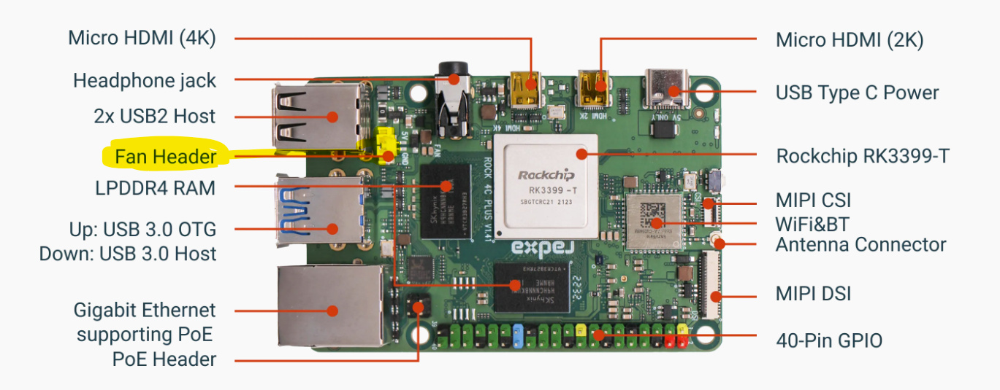

# DietPi and the Radxa Rock 4 C+ board

## Device tree overlays

I wrote several scripts to install and activate device tree overlays. These scripts use (and install) two more universal scripts to `/boot/dietpi`:

- `dietpi-add-overlay`: installs a binary overlay and adds it to dietpiEnv.txt, based on `armbian-add-overlay`, but without using the device tree compiler (dtc) to compile device tree source files to binary overlays (what needs the installation of the dtc)
- `dietpi-activate-overlay`: activates overlays installed with the DietPi firmware (in `/boot/dietpi/dtb/rockchip/overlay`)

These are scripts to activate overlays:

- install device tree overlay for USB OTG (peripheral mode) for the upper USB 3 connector
    ```shell
    curl https://raw.githubusercontent.com/herrfrei/dietpi-rpk4cp/rock4cp_usb_otg.sh | bash
    ```

- Install device tree overlay for the DS3231 realtime clock:

    ```shell
    curl https://raw.githubusercontent.com/herrfrei/dietpi-rock4cp/rock4cp_rtc_ds3231.sh | bash
    ```

  This script also stops and deactivates the fake-hwclock service.
  
## Other adjustments

- use `rock4cp_bluetooth_fw.sh` to create the (missing) link for the Bluetooth firmware:

    ```shell
    curl https://raw.githubusercontent.com/herrfrei/dietpi-rock4cp/rock4cp_bluetooth_fw.sh | bash
    ```
    
- connect a fan: 

  - use a 5V fan and the connector near the USB 2 connector
  
    
  - ensure that thermal-governor is set to `step_wise` (the fan works only at temperatures above 60 degrees Celsius)
    `cat /sys/class/thermal/thermal_zone0/policy` 
    
    If not, set it:
    `echo step_wise > /sys/class/thermal/thermal_zone0/policy`
  
## Installation of teslausb

- Install the device tree overlay for USB OTG from above (`rock4cp_usb_otg.sh`).
- If you want to use an emmc module for the operating system and a SD card or USB stick for the data, add a flag to the call of the installation script. This will skip the resizing of the root file system:

    ```shell
    https://raw.githubusercontent.com/marcone/teslausb/main-dev/setup/generic/install.sh | bash -s norootshrink
    ```
  
  During setup, adjust the `DATA_DRIVE` option in `teslausb_setup_variables.conf` to match your data device.
  Follow the instructions from the [Wiki](https://github.com/marcone/teslausb/wiki/Rock-Pi-4C-plus-Installation)
  